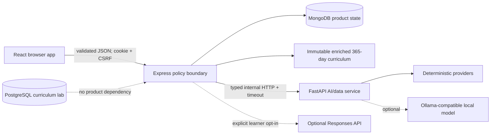
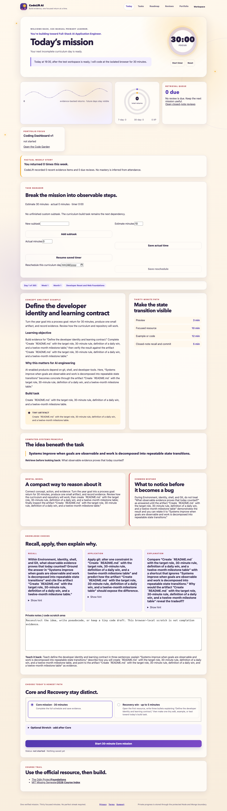
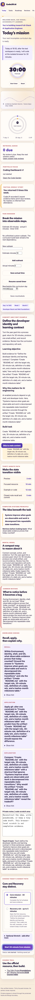
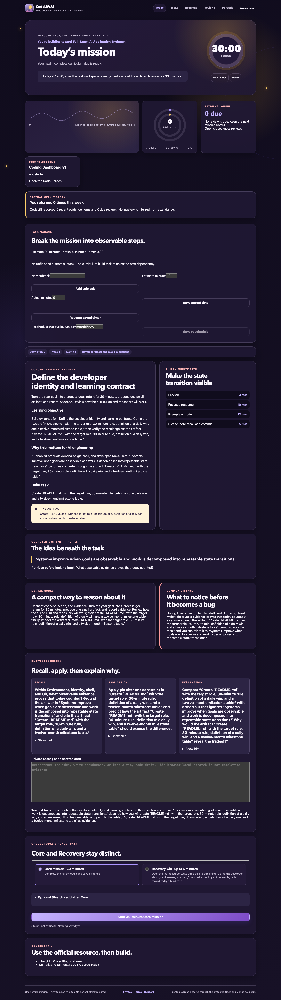
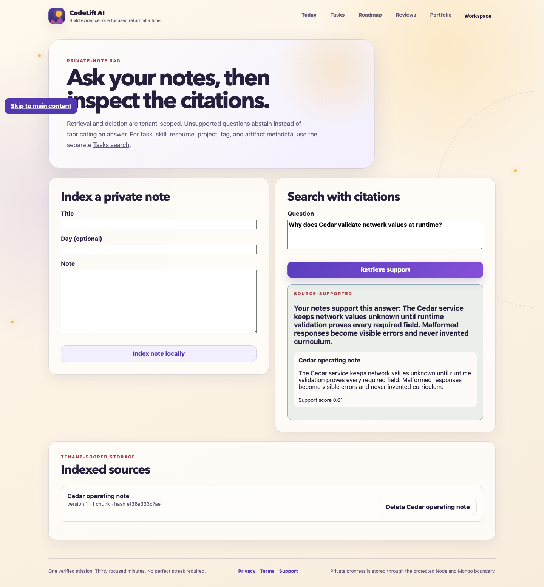

# CodeLift AI

CodeLift AI is a production-shaped, mock-first learning accountability platform
for a returning full-stack developer building toward Full-Stack AI Application
Engineering in 30 focused minutes a day.

It combines a validated 365-day curriculum, evidence-backed MERN progress,
Python/FastAPI learning services, a bounded AI Coach, tenant-scoped cited notes
search, local evals, and an approval-gated planner. The complete path works
without a paid API key or downloaded model.

## What is implemented

- closed/invitation-only/open registration policy, email-bound one-time
  invitations, operator-issued password recovery, all-session reset revocation,
  login/logout, onboarding, protected routes, preferences, versioned account
  export, and transactional account deletion;
- Argon2id passwords, hashed opaque HTTP-only sessions, exact-origin CSRF,
  Helmet, explicit CORS, body/rate limits, request IDs, and generic auth errors;
- 365 deterministic display-ready missions with a 30-minute Core path, ≤5-minute
  Recovery, optional Stretch, mental model, misconception, three nested
  knowledge checks, teach-back, retrieval prompts, evidence types, and direct
  free/official resources;
- next-incomplete date mapping, no auto-skip, humane catch-up, written
  intentional skip, persisted subtasks, estimates/actual time, timer state,
  rescheduling, and reflection drafts;
- spaced reviews at +1/+3/+7/+14/+30, confidence and misconceptions, weekly/
  monthly retrospectives, honest XP/momentum, skills, achievements, Error
  Museum, portfolio artifacts, and career applications;
- private note ingestion with hashing, versioning, chunking, deterministic
  embeddings, hybrid retrieval, citations, support labels, abstention,
  deletion, and cross-user isolation;
- structured mock/Python-mock/OpenAI/local coach adapters with backend-only
  configuration, consent, timeout/retry, kill switch, deterministic fallback,
  capability metadata, hashed traces, and zero-cost default;
- deterministic planning before Month 11 plus a post-unlock typed planning
  graph with durable checkpoints, resumability, allowlisted tools, runtime
  authorization, duplicate detection, budgets, kill switch, trace/terminal
  reasons, and human approval; approved output remains an explicitly labeled
  `proposal_only` record rather than a fabricated task/calendar write;
- FastAPI/Pydantic, pandas progress analysis, a deterministic scikit-learn
  support baseline, provider protocols/mocks, embeddings, reranking, optional
  local inference and PEFT decision lab;
- Docker Compose for web, Node, Mongo replica set, PostgreSQL lab, Python, and
  seed job; GitHub Actions and a machine-readable quality report;
- a separate read-only MCP public-curriculum demo with no learner-data access.

## Architecture



The browser calls only Node. Node owns auth, tenant scope, consent, rate limits,
and public policy. Python is stateless and degrades safely. See the
[system architecture](docs/architecture/system.md) and [ADRs](docs/adr/).

The TypeScript workspace keeps runtime schemas in `packages/contracts`,
curriculum ingestion in `packages/curriculum`, stable product paths and limits
in `packages/config`, local evaluator logic in `packages/evals`, and accessible
React state/status primitives in `packages/ui`.

## Requirements

- Node.js `24.14.0`
- pnpm `11.9.0`
- Python `3.12`
- Docker Desktop/Engine with Compose for the Mongo-backed/full-stack path

Node and pnpm versions are pinned in `.nvmrc`, `.node-version`, and
`package.json`.

## Private Mac self-host checkpoint

The dedicated `infra/compose.selfhost.yaml` runs web, the Node API, and an
authenticated MongoDB replica set with persistent storage, conservative
resource limits, and only `127.0.0.1:8080` published. It defaults to
invitation-only/mock mode, consumes individual secret files outside the
repository, and includes encrypted local backup plus an isolated restore drill.
Follow the [self-host runbook](docs/runbooks/self-host.md). Public HTTPS, a real
secure-cookie browser journey, off-device backup, and reboot/power verification
remain separate gates; the full development demo below is unchanged.

## Fastest complete no-key demo

Build the application images one at a time, matching the bounded release-smoke
path, and then start the already-built stack:

```bash
docker compose -f infra/compose.yaml build api
docker compose -f infra/compose.yaml build web
docker compose -f infra/compose.yaml build ai
docker compose -f infra/compose.yaml --profile tools build seed
docker compose -f infra/compose.yaml up -d --wait --wait-timeout 300
docker compose -f infra/compose.yaml --profile tools run --rm seed
```

Open `http://localhost:8080`. This route uses the included Python mock provider,
persists product data in MongoDB, starts the PostgreSQL curriculum lab, and
downloads no model.

Stop it with:

```bash
docker compose -f infra/compose.yaml down
```

Named volumes preserve local data. Add `--volumes` only when you intentionally
want to delete those local databases.

## Native development

Install JavaScript and Python dependencies:

```bash
pnpm install --frozen-lockfile
python3.12 -m venv services/ai/.venv
services/ai/.venv/bin/pip install uv==0.12.3
services/ai/.venv/bin/uv sync --project services/ai --locked --extra dev
```

Start the Mongo replica set, export the documented native connection, seed, then
run the web/API. The Compose file owns its named volume; a fresh machine does
not need to create one manually.

```bash
docker compose -f infra/compose.m2.yaml up -d --wait
export MONGO_URI='mongodb://127.0.0.1:27018/codelift?replicaSet=rs0&directConnection=true'
export MONGO_DB_NAME='codelift'
export PERSISTENCE_MODE='required'
pnpm seed
pnpm dev
```

The default native provider is `mock`, so Python is not a startup dependency.
To exercise the optional Python mock instead, use separate terminals after the
database is ready and the seed has completed. Do this in place of the combined
`pnpm dev` command above.

Terminal 1 — Python service:

```bash
services/ai/.venv/bin/uvicorn app.main:app \
  --app-dir services/ai --host 127.0.0.1 --port 8000
```

Terminal 2 — API configured for Python:

```bash
export MONGO_URI='mongodb://127.0.0.1:27018/codelift?replicaSet=rs0&directConnection=true'
export MONGO_DB_NAME='codelift'
export PERSISTENCE_MODE='required'
export AI_PROVIDER=python_mock
export AI_PYTHON_BASE_URL=http://127.0.0.1:8000
pnpm dev:api
```

Terminal 3 — web app:

```bash
pnpm dev:web
```

The normal Vite URL is `http://localhost:5173`; Express is on `4000`.
In the full Compose stack the API also starts independently of the Python
container and falls back deterministically if `python_mock` becomes unavailable.

## Environment

`.env.example` is documentation; the application does not automatically load a
root `.env`.

| Variable                           | Purpose                                             | Default                   |
| ---------------------------------- | --------------------------------------------------- | ------------------------- |
| `NODE_ENV`                         | development/test/production policy                  | `development`             |
| `API_PORT`                         | Express port                                        | `4000`                    |
| `WEB_ORIGIN`                       | exact allowed browser origin and CSRF origin        | `http://localhost:5173`   |
| `TRUST_PROXY_HOPS`                 | trusted reverse proxies used for client IP policy   | dev: `0`; prod: required  |
| `PERSISTENCE_MODE`                 | `optional` public-preview degradation or `required` | production: `required`    |
| `MONGO_URI` / `MONGO_DB_NAME`      | Mongo replica connection and database               | documented local values   |
| `REGISTRATION_MODE`                | `closed`, `invite_only`, or development-only `open` | production: `invite_only` |
| `AI_PROVIDER`                      | `mock`, `python_mock`, `local`, or `openai`         | `mock`                    |
| `AI_PYTHON_BASE_URL`               | internal FastAPI URL                                | `http://127.0.0.1:8000`   |
| `AI_LOCAL_BASE_URL`                | Ollama-compatible URL                               | `http://127.0.0.1:11434`  |
| `AI_TIMEOUT_MS` / `AI_MAX_RETRIES` | bounded provider policy                             | `8000` / `1`              |
| `AI_EXTERNAL_ENABLED`              | server-wide remote-provider permission              | `false`                   |
| `AI_AGENT_ENABLED`                 | bounded-agent mode permission                       | `false`                   |
| `OPENAI_BASE_URL`                  | optional Responses API-compatible base              | official API              |
| `OPENAI_MODEL` / `OPENAI_API_KEY`  | backend-only optional model and secret              | empty                     |

Selecting `openai` is not sufficient by itself. External execution also
requires the server flag, the learner’s `ask_before_external` profile choice,
per-request consent, and a disabled kill switch. Requests use the Responses API
with strict JSON-schema output and `store: false`; model IDs come from config.

Private-pilot invitations have a fixed seven-day lifetime and password-reset
links have a fixed one-hour lifetime. These are application policies, not
environment variables; operators revoke and reissue links instead of changing
their validity at runtime.

Production additionally rejects an implicit or HTTP web origin, optional
persistence, missing Mongo, unsafe OpenAI configuration, and open registration.
Open registration remains a future public-launch project because verified
email, automated recovery, and abuse operations are not part of this pilot.

## Private-pilot access and account lifecycle

Run operator commands only from an access-controlled terminal with the managed
Mongo URI injected. The raw bearer URL is printed once; only a SHA-256 digest is
stored. Share it through the approved out-of-band enrollment channel, never in
logs, screenshots, analytics, issues, or chat archives.

```bash
MONGO_URI='<managed replica-set URI>' \
  pnpm operator:access issue-invite \
  --email learner@example.test \
  --base-url https://pilot.example.test \
  --issuer release-owner

MONGO_URI='<managed replica-set URI>' \
  pnpm operator:access revoke-invite --id '<invitation id>'

MONGO_URI='<managed replica-set URI>' \
  pnpm operator:access issue-reset \
  --email learner@example.test \
  --base-url https://pilot.example.test \
  --issuer support-operator
```

An invitation is bound to the normalized email and consumed atomically with
account creation. A reset is single-use, replaces the Argon2id password, and
revokes every active session. The browser never renders link-supplied tokens.
Privacy, terms, and support are public at `/privacy`, `/terms`, and `/support`.
Authenticated settings provide a versioned JSON export plus deliberate account
deletion. See the [data lifecycle runbook](docs/runbooks/data-lifecycle.md).

Aggregate pilot measurement is available in human and JSON forms and suppresses
cohorts smaller than five:

```bash
MONGO_URI='<managed replica-set URI>' \
  pnpm mvp:metrics --since 2026-08-10T00:00:00Z

MONGO_URI='<managed replica-set URI>' \
  pnpm mvp:metrics --since 2026-08-10T00:00:00Z --json
```

The report contains no email, account ID, private note/evidence/reflection, or
per-learner row. `--since` and `--until` are UTC-midnight boundaries for the
half-open `[since, until)` window; omitted `--until` means the current UTC
midnight, excluding the still-open day. The fixed hypothesis, exact D1/D7 and
seven-day-completion semantics, indicators, five research questions, and stop
criteria are in the [pilot plan](docs/mvp-pilot.md).

The [observability adapter](docs/runbooks/observability.md) maps sanitized JSON
request/error events, `/health`, `/ready`, AI traces, and feature flags to
bounded operational metrics without selecting a vendor or adding user tracking.

## Curriculum and seed

The canonical JSON remains immutable. Runtime enrichment deterministically adds
the teaching/display fields and validates all 365 days.

```bash
pnpm curriculum:preflight
pnpm curriculum:validate
pnpm curriculum:links
pnpm seed
pnpm seed:validate
```

Expected evidence:

- source SHA-256
  `af4183cc6d139c34e7ebe63949055fa6fe2e89a25c54c707a4c67a219ed9eb99`;
- 365 sequential days, 52 seven-day weeks plus Day 365;
- 1,095 typed knowledge checks and 841 day-resource references;
- 7,046 semantic fields checked with zero generic-field failures, anchor
  failures, knowledge-check failures, or normalized duplicate groups;
- 365 `CurriculumDay` and 88 `Resource` records after idempotent seed;
- every Core schedule totals 30 minutes;
- all resources are HTTPS and carry a checked status.

The bounded link command uses HEAD then GET, concurrency, timeout, retry, and
records `unknown` separately from malformed or missing links. See the
[maintenance guide](docs/curriculum/maintenance.md).

## Quality commands

```bash
pnpm --version
pnpm install --frozen-lockfile
pnpm format:check
pnpm lint
pnpm typecheck
pnpm test
pnpm test:integration
pnpm test:e2e
pnpm browser:evidence
pnpm build
pnpm seed
pnpm seed
pnpm seed:validate
pnpm curriculum:preflight
pnpm curriculum:validate
pnpm curriculum:links
pnpm eval:local
pnpm mcp:check
pnpm security:check
pnpm security:audit
pnpm python:lock-check
pnpm python:audit
pnpm image:audit
pnpm mvp:check
pnpm performance:check
pnpm compose:check
pnpm compose:smoke
pnpm fresh-clone:check
pnpm quality:report
```

`test:integration`, `test:e2e`, seed commands, and the final quality report
require the local Mongo replica set. `test:e2e` runs real Chromium journeys with
isolated test users and a guarded `_e2e_test` database. The separate
`browser:evidence` command validates the source-digest-bound manual visual
record; manual evidence supplements, and never substitutes for, Playwright.
The repeated seed is intentional and proves idempotency. `compose:smoke` builds
all production images on fresh named volumes, runs the seed job, exercises the
Python mock, stops Python, verifies deterministic web/API fallback, and deletes
its synthetic account. A dirty pre-commit smoke may pass those behavioral
checks, but its report is not revision-bound; the aggregate quality gate
requires a clean source tree at both ends of the smoke. `fresh-clone:check`
requires a clean committed revision, clones it without hardlinks into a
temporary directory, performs the frozen offline JavaScript install, verifies
the interpreter is Python 3.12, synchronizes Python development dependencies
from `services/ai/uv.lock` with pinned uv 0.12.3, builds/tests, and repeats the
fresh-volume Compose smoke. JavaScript and Python both use checked-in locks.
The aggregate quality report runs
these commands itself and rejects stale reports, a dirty revision, an unpinned
toolchain, or source-mismatched clone/container evidence.

Python checks are included in the root gates and are also available as
`pnpm python:check`. The release gate also verifies the Python lock, audits the
locked Python and JavaScript graphs, scans each production image for
HIGH/CRITICAL vulnerabilities, and checks the M16 source/configuration contract.

## Evaluation, privacy, and cost

`evals/datasets/local-safety-v1.json` contains 38 executable, provider-independent
schema, safety, usefulness, retrieval, grounding, citation, injection, isolation,
consent, failure-normalization, tool, budget, agency, and output-handling cases.
`pnpm eval:local` executes deterministic synthetic provider transports without an
external network call or model download and writes expected-versus-observed evidence
to `reports/local-ai-eval.json`.

Private notes remain tenant scoped. AI traces store configuration/metrics and a
hash of input, not raw private reflection text. Supported RAG statements link
to source/chunk citations; unsupported questions abstain. Account deletion
transactionally removes product and derived/index records.

Read the [security policy](SECURITY.md), [threat model](docs/security/threat-model.md),
[eval strategy](docs/evals/strategy.md), and [AI operations runbook](docs/runbooks/ai-operations.md).

## Design and accessibility

The “Cosmic Sunrise Workshop” uses semantic tokens, light/dark themes, visible
focus, mobile-first reflow, and reduced-motion behavior. Signature code-native
components include JourneyMap, SkillConstellation, CodeGarden, MomentumOrbit,
MilestonePeak, ErrorMuseum, WeeklyStory, AchievementShelf, FocusOrb,
ParticleBurst, CourseTrail, and EvidenceCard. Color is not the only state cue.

The private gallery route is `/app/gallery`; the development console is
`/admin` and is omitted from the production route table, navigation, return-path
allowlist, and API surface.

## Source-current release screenshots

These synthetic-account captures come from the final manual browser review and
the real Playwright visual/accessibility journey. They contain no personal data.

### Today — wide, light theme



### Today — exact 320px reflow



### Today — dark theme with reduced motion



### Private-note RAG — source-supported answer



## Deployment and operations

See [deployment](docs/deployment.md), [release checklist](docs/release-checklist.md),
[incident response](docs/runbooks/incident-response.md), and
[data lifecycle](docs/runbooks/data-lifecycle.md). The
[deployment decision packet](docs/deployment-decision.md) compares three current
pilot options without provisioning them, and [release governance](docs/release-governance.md)
records the draft-PR/default-branch/protection procedure.

Production needs TLS, exact `WEB_ORIGIN`, private service networking, secret
injection, Mongo replica availability/backups, resource budgets, monitoring,
and readiness routing. The repository intentionally does not fabricate a hosted
production URL. A clean source gate means source-ready; a live pilot additionally
requires an approved environment, centralized alerts, a successful isolated
backup restore, and the guarded HTTPS journey documented in the deployment guide.

## Tradeoffs and limitations

Deterministic embeddings make retrieval repeatable for the same implementation
and inputs, but they are a semantic baseline. React Router owns explicit client
routes, guarded workspace layouts, and browser history; server loaders, SSR,
and RSC routing remain out of scope. The base install never downloads a local
model. Live resource results are point-in-time evidence. Details are in
[known limitations](docs/known-limitations.md).

## Portfolio and interview material

- [Demo script](docs/portfolio/demo-script.md)
- [Resume bullet drafts](docs/portfolio/resume-bullets.md)
- [System-design walkthrough](docs/portfolio/system-design-walkthrough.md)

Useful interview themes are executable trust boundaries, evidence-backed state
machines, honest progress metrics, tenant-scoped retrieval, deterministic
fallback, human approval, and the decision to keep the MERN product core
separate from a stateless Python learning service.
