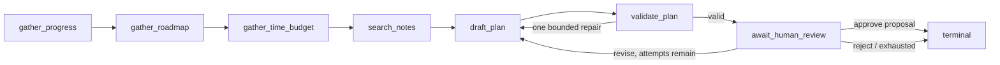

# ADR 0006: Bounded, approval-gated planning workflow

- Status: accepted
- Date: 2026-07-24

## Context

A weekly study planner can help organize work, but an autonomous agent that
silently changes learner state would violate autonomy and create cost and
authorization risk. The curriculum does not introduce agent behavior until
Month 11.

## Decision

Before Month 11, use a deterministic workflow. After the curriculum unlock,
server configuration, and feature flag all permit it, the same typed `AgentRun`
boundary may use a bounded agent mode. The implementation is an explicit graph:

The durable graph state contains the request, gathered evidence, draft,
validation errors, feedback, budget counters, completed-node and tool-call
idempotency keys, checkpoints, trace events, and terminal reason. Persisted
state is runtime parsed and checked against the authenticated user and run ID
before resume or decision handling. A checkpoint is written after every
repeat-safe node, so a process interruption resumes from `nextNode` without
replaying completed tool calls.

The allowlisted registry exposes four read-only tools—progress, curriculum
roadmap, time budget, and tenant-scoped note search—and one separately guarded
write tool for deployments that explicitly choose `persist_on_approval`.
Arguments and results are runtime validated, and authorization is checked again
at execution time. Every run:

- has at most seven proposed actions and one Core mission per date;
- records step, token, cost, and wall-time budgets;
- starts read-only and stops at `awaiting_approval` before any side effect;
- requires an authenticated, CSRF-protected approve or revise request;
- detects duplicate decisions with idempotency keys;
- records a terminal reason and trace;
- honors an agent feature flag and global AI kill switch;
- retains a deterministic fallback.

The current product route deliberately uses `proposal_only`. Approving records
that the learner accepted the proposal and performs no task/product-state write;
the contract, trace, and UI must say this explicitly. The registry's write path
exists only as a tested capability boundary and cannot run without an approved
human decision plus the `persist_on_approval` policy.

## Consequences

- Planning stays usable for free and before agent lessons unlock.
- Human approval is a real audited state transition, not decorative UI, while
  the current approval remains an accepted proposal rather than a claimed save.
- Adding write-capable tools requires a new ADR, execution-time authorization,
  and red-team coverage.
- Durable checkpoints add storage and schema-versioning cost, but make recovery,
  trace evaluation, and duplicate-side-effect prevention testable.
