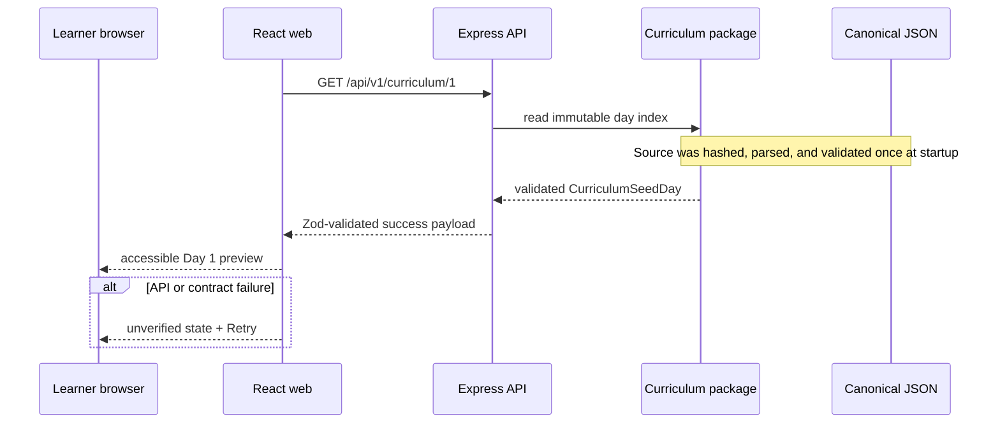

# Milestone 1 Architecture

## Trust boundaries

- JSON file → curriculum package: untrusted file input, parsed from `unknown`.
- curriculum package → API: immutable validated domain record.
- API → browser: untrusted network input, parsed again by shared schema.
- resource link → third-party course: user-initiated navigation only; no server
  proxy or automatic fetch.

## Operational behavior

`/health` answers whether the Express process is alive. `/ready` answers whether
the canonical curriculum loaded and passed validation. These states are
separate so a process cannot claim the curriculum is usable after source
failure.
