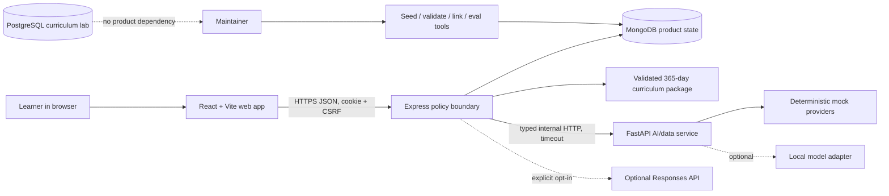
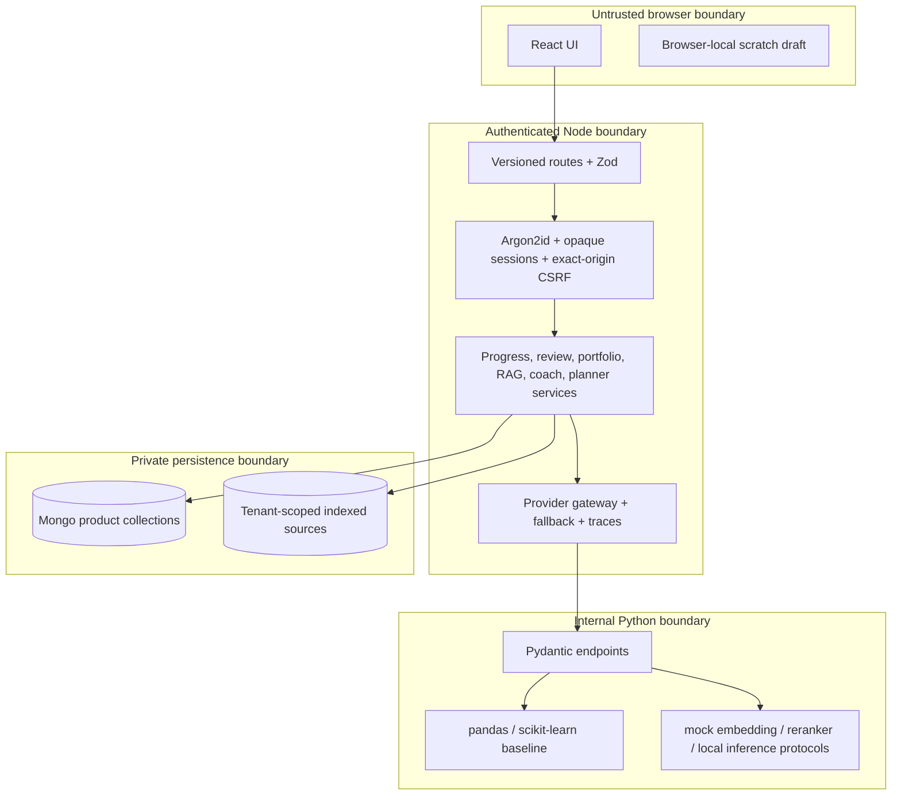
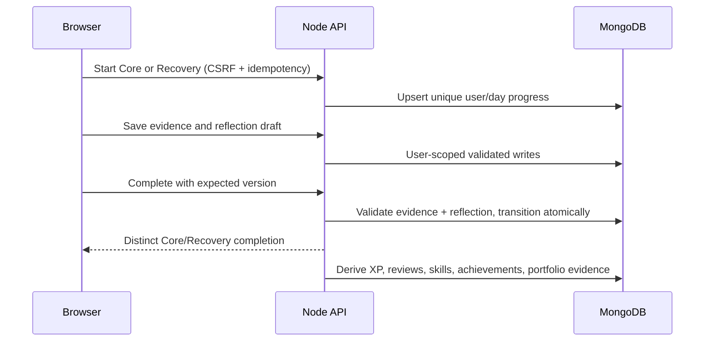
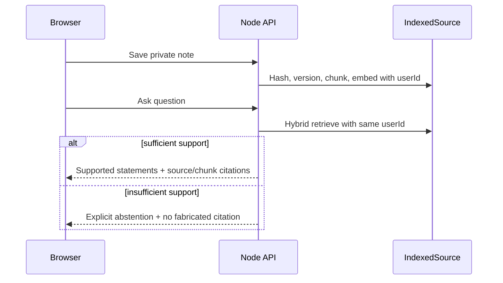

# CodeLift AI system architecture

## Context



The browser never receives a provider key and never calls Python or a model
provider. Express is the only public policy boundary.

## Containers and trust boundaries



## Major components

- `packages/contracts`: strict runtime contracts shared by browser and Node.
- `packages/config`: environment-neutral product paths and stable operational /
  input limits shared by browser and Node; runtime validation remains in the
  contracts and service boundaries.
- `packages/curriculum`: immutable source preflight plus deterministic,
  display-ready enrichment.
- `packages/evals`: shared executable behavioral evaluation used by the CLI,
  API, UI, and release-quality report.
- `packages/ui`: accessible React state and live-status primitives that render
  against the web app's semantic design-token classes.
- `apps/api/account`: authentication, onboarding, progress state machine,
  evidence, reflection, and deletion transaction.
- `apps/api/learning`: roadmap, reviews, skills, task plans, portfolio/career,
  private notes, RAG, coach, planner, traces, and evals.
- `services/ai`: stateless typed analysis and provider protocols.
- `services/mcp`: separate read-only public-curriculum demo with three
  allowlisted tools and no learner access.

## Important flows

### Evidence-backed completion



### Grounded note answer



### Durable bounded plan

```mermaid
sequenceDiagram
  participant B as Browser
  participant N as Node API
  participant G as Typed planner graph
  participant T as Authorized tool registry
  participant M as MongoDB
  B->>N: Propose week (CSRF + idempotency key)
  N->>M: Create running AgentRun with initial graph state
  loop bounded read-only nodes
    G->>T: Runtime-validated user-scoped tool call
    T-->>G: Runtime-validated result
    G->>M: Persist repeat-safe checkpoint and trace
  end
  G-->>B: Await human review with evidence, budget, and trace
  B->>N: Approve or revise (expected status + idempotency key)
  alt current proposal-only policy
    N->>M: Record accepted proposal; no product/task write
  else explicitly configured persistence policy
    G->>T: Authorized write only after approval
    T->>M: Idempotent approved-plan persistence
  end
```

## Failure behavior

- Mongo required mode: readiness fails and private routes do not use memory.
- Python/provider outage: timeout is bounded and Node returns deterministic
  validated fallback.
- Invalid curriculum: readiness fails closed; no fabricated mission.
- Unsupported RAG question: explicit abstention.
- Planner budget, validation, authorization, kill-switch, or approval boundary:
  the graph fails closed or falls back deterministically, records a terminal
  reason, and performs no unapproved side effect.

See the ADRs, threat model, and runbooks for decision and operational detail.
